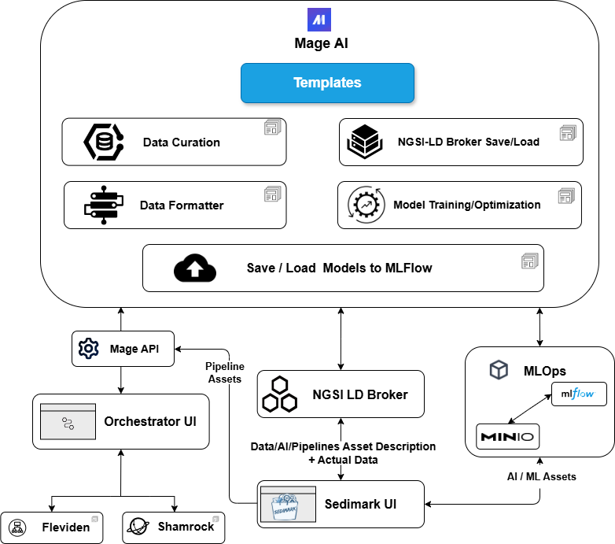

# 🚀 Sedimark Toolbox

A comprehensive deployment solution for data pipelines, machine learning workflows, and NGSI-LD context broker services. This repository provides Docker-based deployments for the complete Sedimark ecosystem.

## 📋 Table of Contents

- [🚀 Sedimark Toolbox](#-sedimark-toolbox)
  - [📋 Table of Contents](#-table-of-contents)
  - [🏗️ Architecture Overview](#️-architecture-overview)
  - [📦 Repository Structure](#-repository-structure)
  - [⚡ Quick Start](#-quick-start)
    - [Complete Deployment](#complete-deployment)
  - [🔧 Prerequisites](#-prerequisites)
  - [🚢 Deployment Options](#-deployment-options)
    - [1. AI/ML Pipeline Toolbox](#1-aiml-pipeline-toolbox)
    - [2. NGSI-LD Context Broker](#2-ngsi-ld-context-broker)
  - [🌐 Service Access](#-service-access)
    - [AI/ML Toolbox Services](#aiml-toolbox-services)
    - [NGSI-LD Broker Services](#ngsi-ld-broker-services)
  - [📚 Component Documentation](#-component-documentation)
    - [Core Repositories](#core-repositories)
    - [External Components](#external-components)
  - [⚙️ Configuration](#️-configuration)
    - [Environment Variables](#environment-variables)
    - [Key Configuration Areas](#key-configuration-areas)
    - [Customization](#customization)
  - [🤝 Contributing](#-contributing)
  - [📄 License](#-license)
  - [🆘 Support](#-support)

## 🏗️ Architecture Overview

The Sedimark Toolbox provides two main deployment scenarios:

1. **AI/ML Pipeline Toolbox** - Complete machine learning workflow management
2. **NGSI-LD Context Broker** - Standards-compliant context information management



*The architecture enables seamless integration between data ingestion, processing, model training, and deployment workflows.*

## 📦 Repository Structure

```
Sedimark-Toolbox/
├── 📁 toolbox_deployment/          # AI/ML Pipeline Services
│   ├── 🐳 docker-compose.yaml     # Main toolbox orchestration
│   ├── 🔧 .env                    # Environment configuration
│   ├── 🐳 MLflow                  # MLflow Dockerfile
│   ├── 🐳 MinioInit               # Minio initialization
│   ├── 🔧 init.sh                 # Minio setup script
│   └── 📖 README.md               # Toolbox documentation
│
├── 📁 ngsild_broker_deployment/    # Context Broker Services
│   ├── 🐳 docker-compose.yml      # Stellio broker setup
│   ├── 🔧 .env                    # Broker configuration
│   └── 📖 README.md               # Broker documentation
│
├── 📁 images/                      # Documentation assets
│   └── 🖼️ main-arhitecture.png
│
├── 📖 README.md                    # This file
└── 📝 .gitattributes              # Git LFS configuration
```

## ⚡ Quick Start

### Complete Deployment

```bash
# Clone the repository
git clone https://github.com/Sedimark/Sedimark-Toolbox.git
cd Sedimark-Toolbox

# Create shared network (required for inter-service communication)
docker network create shared_network

# Deploy AI/ML Toolbox
cd toolbox_deployment
docker-compose up -d

# Deploy NGSI-LD Broker (optional, in separate terminal)
cd ../ngsild_broker_deployment
docker-compose up -d
```

## 🔧 Prerequisites

- **Docker** (v20.10+) & **Docker Compose** (v2.0+)
- **Git** with LFS support
- **8GB+ RAM** recommended for full deployment
- **Ports available**: 3000, 5000, 6789, 8001, 8080, 8083-8085, 9000-9001, 10100

## 🚢 Deployment Options

### 1. AI/ML Pipeline Toolbox

Deploy the complete machine learning workflow stack:

```bash
cd toolbox_deployment
docker-compose up -d
```

**Includes:**
- 🔬 **MLflow** - Experiment tracking and model registry
- 🗄️ **PostgreSQL** - Metadata storage
- 📦 **MinIO** - Artifact storage (S3-compatible)
- 🪄 **MageAI** - Data pipeline orchestration
- 🔗 **APIs** - REST interfaces for workflow management
- 🎛️ **Orchestrator UI** - Web-based management interface

### 2. NGSI-LD Context Broker

Deploy the standards-compliant context information management system:

```bash
cd ngsild_broker_deployment
docker-compose up -d
```

**Includes:**
- 🌟 **Stellio** - NGSI-LD compliant context broker
- 🗄️ **PostgreSQL** with TimescaleDB - Time-series data storage
- 🔄 **Kafka** - Event streaming platform

## 🌐 Service Access

### AI/ML Toolbox Services
| Service | URL | Purpose | Credentials |
|---------|-----|---------|-------------|
| 🎛️ **Orchestrator** | http://localhost:3000 | Workflow Management UI | - |
| 🔬 **MLflow** | http://localhost:5000 | ML Experiment Tracking | `admin` / `password1234` |
| 🪄 **MageAI** | http://localhost:6789 | Data Pipeline IDE | `admin@admin.com` / `admin` |
| 📦 **MinIO Console** | http://localhost:9001 | Object Storage UI | `admin` / `minio_sedimark` |
| 🔗 **Mage API** | http://localhost:8085 | Pipeline API | - |
| 📊 **MLflow API** | http://localhost:8001 | Model Registry API | - |

### NGSI-LD Broker Services
| Service | URL | Purpose |
|---------|-----|---------|
| 🌟 **Stellio API** | http://localhost:8080 | Context Broker API |
| 🔍 **Search Service** | http://localhost:8083 | Entity Search API |
| 📡 **Subscription Service** | http://localhost:8084 | Notification Management |

## 📚 Component Documentation

### Core Repositories
- **🔗 Mage API**: [Sedimark/MageAPI](https://github.com/Sedimark/MageAPI)
- **🎛️ Orchestrator UI**: [Sedimark/Sedimark-Orchestration-UI](https://github.com/Sedimark/Sedimark-Orchestration-UI)
- **📊 MLflow API**: [Sedimark/mlflow_api](https://github.com/Sedimark/mlflow_api)

### External Components
- **🔬 MLflow**: [mlflow/mlflow](https://github.com/mlflow/mlflow)
- **🪄 Mage AI**: [mage-ai/mage-ai](https://github.com/mage-ai/mage-ai)
- **🌟 Stellio**: [stellio-hub/stellio-context-broker](https://github.com/stellio-hub/stellio-context-broker)
- **📦 MinIO**: [minio/minio](https://github.com/minio/minio)

## ⚙️ Configuration

### Environment Variables

Both deployments use `.env` files for configuration:

- **[toolbox_deployment/.env](toolbox_deployment/.env)** - AI/ML services configuration
- **[ngsild_broker_deployment/.env](ngsild_broker_deployment/.env)** - Broker services configuration

### Key Configuration Areas

1. **Authentication Settings** - User credentials and access control
2. **Network Configuration** - Port mappings and service discovery
3. **Storage Configuration** - Database connections and object storage
4. **Integration Settings** - API endpoints and service URLs

### Customization

For detailed configuration options, refer to:
- **📖 [Toolbox Configuration](toolbox_deployment/README.md)**
- **📖 [Broker Configuration](ngsild_broker_deployment/README.md)**

---

## 🤝 Contributing

Contributions are welcome! Please refer to the individual component repositories for development guidelines.

## 📄 License

This project is licensed under [MIT LICENSE](LICENSE)

## 🆘 Support

For issues and support:
1. Check the component-specific README files
2. Review the individual repository documentation
3. Create an issue in the relevant component repository
